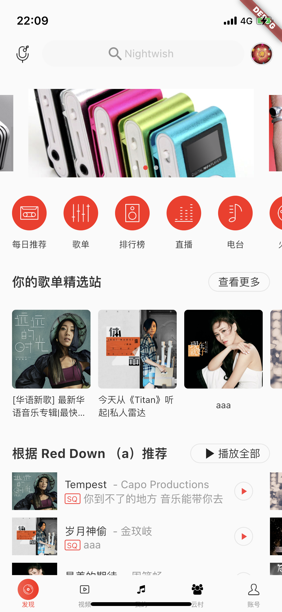

****# music

## 1. 初识
1. Widget-> 原件/组件
可以放到视图当中被用户使用的东西,看的见或者看不见的(gesture)叫做Widget
2. State   
StatelessWidget 无状态 -> 自身不变 -> 性能高 
StatefulWidget 有状态 -> 自身会变 -> 性能较低
   
-----------------------------------------------------------------
3. 包
- 系统包
- 自己构建的
- 三方包

pub.dev如何使用
1. 添加依赖
   pubspec.yaml
2. 安装依赖
   flutter pub get
3. 引入包
   import 'package:flutter_hooks/flutter_hooks.dart'

-----------------------------------------------------------------
**变量**
1. 类型
int,double
String
List
Map

2. 其他声明方式
final 仅保护赋值
   编译期-赋值

const 保护赋值和内容
   编译期-赋值
   运行时

-----------------------------------------------------------------

1. 类型
   int a;
   double b;
2. var 
   var a = 12;
   int a = 12;

   var a;
   dynamic a;
3. 只读
   1. final 赋值
   2. const 赋值 + 内容
4. dynamic
   
   var a = 12; => int a = 12;
   var a; => dynamic = a; // 不限制类型
   typedef Func = int Function(int,int);

   var依赖推测 -> 方便
   dynamic 接受任何东西，默认类型


-----------------------------------------------------------------
**声明一个变量方式**
1. 写死
int a;

2. 常量
final: 仅保护赋值，只在编译期检查
const： 保护了赋值以及内部修改，在运行时也存在  
3. 
dynamic和var的区别
dynamic： 真实类型
var： 赋值时候是什么类型就是什么

-----------------------------------------------------------------
**函数**
1. 返回值类型 
void 没有函数返回值
2. 名字
3. 参数列表
声明参数需要定义类型,
   1. 可选参数,不赋值为null 
   - 可选参数必须位于参数的最后一个位置
   2. 具名参数
   - {}
   - 不关注赋值顺序，也是可选参数。并且可以默认值，默认值传则用新的，不传则用默认值。
**函数特点**
1. 不支持重载，即不同参数的相同名字的函数。不可以直接重载。

-----------------------------------------------------------------

**lambda&typedef**
1. lambda就是箭头函数
2. 类型声明
   1. var 可以用
   2. dynamic尽量不要用
3. typeof
在订阅或者通知的时候，会将一个函数以参数的方式传递给另一个函数

-----------------------------------------------------------------
**数据类型**
1. 数字
int：64位有符号整型
BigInt：没有上限
double： 64位双精度浮点数，上限10^308
2. 字符串转数字
num.parse
int.parse
double.parse
   1. try{}catch(e){}
   2. tryParse,能转换则正常转换，不能转换则为null
3. 自动类型转换
**类型转换**
1. 使用类提供的方法(有限的)
toString,toInt
2. 转换对象的方法
as：是运行时类型，**不建议使用**，实际上没有完成任何转换操作，只是让某个变量按照什么类型来用。

-----------------------------------------------------------------
**字符串**
1. 字符串写法
   1. 'xxx'
   2. "xxx"
   3. '''xxx aaa bbb''',多行字符串
   4. """xxx aaa bbb""",多行字符串
2. 字符串模板
   1. var str = 'a=$a';
   2. var str = 'a=${a}b=${a}'
3. 字符串对象
length:表示是有几个字
codeUnits:按照编码为单位，返回值
toLowerCase()
toUpperCase()
trim()
replaceAll()
replaceFrist()
replaceAllMapped('xx',callback)
replaceFristMapped('xx',callback)
substring(5,10); // 5-9
codeUnitAt(); // 去字符串编码

-----------------------------------------------------------------
**数组**
1. 定长和变长
定长：a = List(3)
变长：add()，addAll()
2. List成员
length
[..]
add(el)
addAll()

contain() : 返回元素
indexOf() ：返回索引

sublist(start,[end]); // 不包含最后一个

insert(index,el)
insertAll(index,[])

remove(el)
removeAt(index);

forEach();
map((e) => {}) : 返回Iterable,可迭代对象,可以在最后加上toList()转换成List

-----------------------------------------------------------------
**泛型**
泛型不是没有类型，类型可以作为一个特殊参数传进去。

-----------------------------------------------------------------
**Map**
1. 没有两个相同的Map，内存中存放的地址不一样
```dart
var m = Map<String, int>();
```
m.addAll({...})

m.containsKey(key) => bool
m.containValue(value) => bool

m.remove(key)
m.removeWhere((key,value) => true);

m.forEach((keym,value){})
map((key,map) => MapEntry(key,666));

-----------------------------------------------------------------
if

switch case

forEach()

for in
```dart
for(var key in m){print(key)};
```

while()
do while()
```
do {
   print(a);
   a++;
}while(a < 5);
```

try{
   可能产生运行时错误
}on RangeError{

}
catch(

)finaly{
   无论如何都执行，回收资源
}
## 2. 面向对象
### base
程序 = 数据（变量） + 操作（函数）
对象 = 数据（属性） + 操作（方法）
类 = 属性 + 方法 + 访问器 + 构造器

dart里面new可选-任何情况下，都可以不写
dart里面this可以选-没有冲突可选，有冲突加上，当成员变量和普通变量重名，那么就要用this

------------------------------------------
### 构造函数

dart的class中没有访问修饰符
public
private
protected
我们常用下划线来表示一个变量是私有的

**构造器**：构建类的实例的时候会自动执行，可以完成初始化操作。跟类是同名函数、没有返回值。
1. 默认构造器
2. 具名构造器


------------------------------------------

访问器： 控制get、set操作


### 静态成员
静态成员  无需实例化直接在类上访问，所有实例共享一个数据
实例成员 Person().a
static: 类成员 Person.a

问: 为甚final可选static—每个实例可能不同
问：为什么const必选static-每个实例一定相同（节约资源）

final 禁止赋值 
final a = [1,23,4] // 每个实例的a是不同的，因为可以修改a

const a = [123,23432,123] // 每个实例的a是相同的，不可以修改

------------------------------------------
**继承**
概念：从已有类（父类）上继承出一个新的类（子类、派生类）

1. 怎么写
```dart
class Base {
  void show() {}
}

class Derived extends Base {}

void main() {
  var a = Derived();
}
// 子类的功能可以自己扩展
```
2. 有什么用
   1. 重用已有代码
   2. 父类变量，子类不需要任何修改直接享受父类的变化-降低维护成本-bug-行为修改
   3. 层级关系
3. 重载override
   1. 函数重载-dart不支持
      1. show(int a){}
      2. show(String a){}
   2. 父类重载-重写父类方法
      1. 直接复制父类的代码-及其不靠谱
      2. 在重载的子类方法汇总，直接调用父类方法。super.xxx();
   3. 重载构造器
      ```dart
      constructor(父类参数，子类参数....):super(父类参数){
          // 子类构造工作 
      }
      ```

------------------------------------------

### 抽象类
抽象类： 不能被实例化、无需提供方法的实现
主要为导航，告诉我们继承他的实例主要需要来实现哪些方法，具体方法需要在子类中自己去实现。

------------------------------------------

### 接口
dart
// 继承
class base{...}
class a extends base{}

// 实现
class interface1 {}
class a implements interface1{}

// 可以把接口当做类型来源ongoing，存储的是所有实现了这个接口的类的实例

**问题**
在dart中继承和实现的区别
1. 单继承和多实现
   1. 单继承：优势：层级关系清晰，劣势不够灵活。
   2. 多重实现：优势：灵活，不会对继承有影响。
2. 使用场景
   1. 继承 => 层级关系
   2. 接口 => 提供能力

------------------------------------------

# music项目开发
## 阶段一
```Text
首页组件构成

lib/pages/home/
home.dart     // 首页
header.dart  // 音乐采集识别 + 搜索 + 头像
banner.dart // header区域轮播图
category.dart // 功能分类区域

-----------------------------------

lib/pages/widgets
song_list.dart     // 你的歌单精选站 & 查看更多 & 滚动显示
recommend_list.dart // 根据Red Down (a)推荐 & 推荐歌曲滚动显示
global_bottom_navigation_bar.dart // 底部导航栏 & 跳转广场 & 做Hero动画清除

-----------------------------------

lib/router.dart  // 页面导航路由
```
